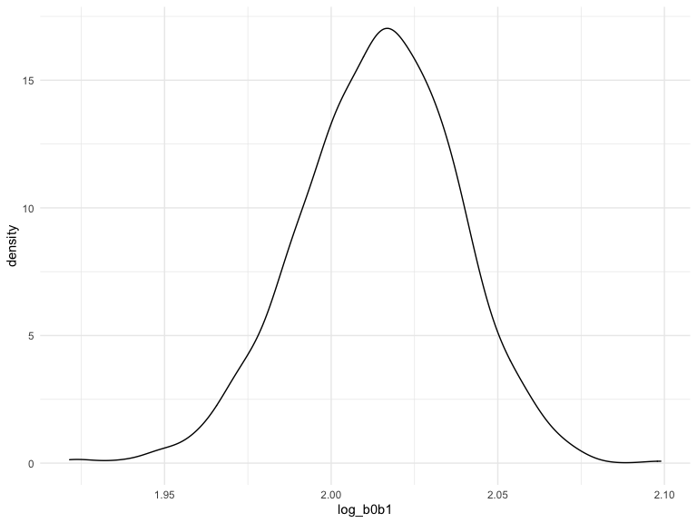

p8105_hw6_ms6360
================
Maisie Sun
2022-11-21

# Problem 1

``` r
weather_df = 
  rnoaa::meteo_pull_monitors(
    c("USW00094728"),
    var = c("PRCP", "TMIN", "TMAX"), 
    date_min = "2017-01-01",
    date_max = "2017-12-31") %>%
  mutate(
    name = recode(id, USW00094728 = "CentralPark_NY"),
    tmin = tmin / 10,
    tmax = tmax / 10) %>%
  select(name, id, everything())
```

    ## Registered S3 method overwritten by 'hoardr':
    ##   method           from
    ##   print.cache_info httr

    ## using cached file: ~/Library/Caches/R/noaa_ghcnd/USW00094728.dly

    ## date created (size, mb): 2022-09-29 10:31:44 (8.401)

    ## file min/max dates: 1869-01-01 / 2022-09-30

``` r
weather_df %>% 
  modelr::bootstrap(n = 1000) %>% 
  mutate(
    models = map(strap, ~lm(tmax ~ tmin, data = .x) ),
    results = map(models, broom::glance)) %>% 
  select(-strap, -models) %>% 
  unnest(results) %>% 
  ggplot(aes(x = r.squared)) + geom_density()
```


``` r
weather_df %>% 
  modelr::bootstrap(n = 1000) %>% 
  mutate(
    models = map(strap, ~lm(tmax ~ tmin, data = .x) ),
    results = map(models, broom::tidy)) %>% 
  select(-strap, -models) %>% 
  unnest(results) %>% 
  select(id = `.id`, term, estimate) %>% 
  pivot_wider(
    names_from = term, 
    values_from = estimate) %>% 
  rename(beta0 = `(Intercept)`, beta1 = tmin) %>% 
  mutate(log_b0b1 = log(beta0 * beta1)) %>% 
  ggplot(aes(x = log_b0b1)) + geom_density()
```



# Problem 2

1.  Import data

``` r
homicide_data = 
  read_csv("./data/homicide-data.csv") %>%
  janitor::clean_names()
```

    ## Rows: 52179 Columns: 12
    ## ── Column specification ────────────────────────────────────────────────────────
    ## Delimiter: ","
    ## chr (9): uid, victim_last, victim_first, victim_race, victim_age, victim_sex...
    ## dbl (3): reported_date, lat, lon
    ## 
    ## ℹ Use `spec()` to retrieve the full column specification for this data.
    ## ℹ Specify the column types or set `show_col_types = FALSE` to quiet this message.

2.  Clean data

``` r
homicide_data_p2 = 
  homicide_data %>%
  unite("city_state", city:state, remove = FALSE, sep = ", ") %>%
  filter(
    !city_state %in% c("Dallas, TX", "Phoenix, AZ", "Kansas City, MO", "Tulsa, AL")) %>%
  filter(victim_race == "White" | victim_race == "Black") %>%
  mutate(resolved = as.numeric(disposition == "Closed by arrest"),
    victim_age = as.numeric(victim_age),
    victim_race = fct_relevel(victim_race, "White")) %>%
  select(city_state, resolved, victim_age, victim_sex, victim_race) %>%
  drop_na()
```

- There are 39403 observations and 5 variables in this cleaned dataset.
  The variables are: city_state, resolved, victim_age, victim_sex,
  victim_race.

``` r
fit_logistic_Baltimore = 
  homicide_data_p2 %>% 
  filter(city_state == "Baltimore, MD") %>%
  glm(resolved ~ victim_age + victim_race + victim_sex, data = ., family = binomial()) %>%
  broom::tidy(conf.int = TRUE)
```

3.  Fit logistic regression for Baltimore, MD, for resolved vs
    unresolved cases comparing male victims to female victims

``` r
result_Baltimore = 
  fit_logistic_Baltimore %>%
  mutate(
    OR = exp(estimate),
    lower95CI = exp(conf.low),
    upper95CI = exp(conf.high)) %>%
  select(term, OR, lower95CI, upper95CI) %>%
  filter(term == "victim_sexMale")

result_Baltimore %>%
  knitr::kable(digits = 3)
```

| term           |    OR | lower95CI | upper95CI |
|:---------------|------:|----------:|----------:|
| victim_sexMale | 0.426 |     0.324 |     0.558 |

- The estimated odds ratio of resolved homicides comparing male victims
  to female victims is 0.4255117, the 95% confidence interval is
  (0.3241908, 0.5575508).

4.  Fit logistic regression for all cities for resolved vs unresolved
    cases comparing male victims to female victims

``` r
results_cities = 
  homicide_data_p2 %>%
  nest(data = -city_state) %>% 
  mutate(
    logistic = map(data, ~glm(resolved ~ victim_age + victim_race + victim_sex, data = ., family = binomial())),
    results = map(.x = logistic, ~broom::tidy(.x,conf.int = TRUE))) %>% 
  select(city_state, results) %>% 
  unnest(results) %>% 
  mutate(
OR = exp(estimate),
    lower95CI = exp(conf.low),
    upper95CI = exp(conf.high)) %>%
  select(city_state, term, OR, lower95CI, upper95CI) %>%
  filter(term == "victim_sexMale")

results_cities %>% 
  knitr::kable(digits = 3)
```

| city_state         | term           |    OR | lower95CI | upper95CI |
|:-------------------|:---------------|------:|----------:|----------:|
| Albuquerque, NM    | victim_sexMale | 1.767 |     0.825 |     3.762 |
| Atlanta, GA        | victim_sexMale | 1.000 |     0.680 |     1.458 |
| Baltimore, MD      | victim_sexMale | 0.426 |     0.324 |     0.558 |
| Baton Rouge, LA    | victim_sexMale | 0.381 |     0.204 |     0.684 |
| Birmingham, AL     | victim_sexMale | 0.870 |     0.571 |     1.314 |
| Boston, MA         | victim_sexMale | 0.674 |     0.353 |     1.277 |
| Buffalo, NY        | victim_sexMale | 0.521 |     0.288 |     0.936 |
| Charlotte, NC      | victim_sexMale | 0.884 |     0.551 |     1.391 |
| Chicago, IL        | victim_sexMale | 0.410 |     0.336 |     0.501 |
| Cincinnati, OH     | victim_sexMale | 0.400 |     0.231 |     0.667 |
| Columbus, OH       | victim_sexMale | 0.532 |     0.377 |     0.748 |
| Denver, CO         | victim_sexMale | 0.479 |     0.233 |     0.962 |
| Detroit, MI        | victim_sexMale | 0.582 |     0.462 |     0.734 |
| Durham, NC         | victim_sexMale | 0.812 |     0.382 |     1.658 |
| Fort Worth, TX     | victim_sexMale | 0.669 |     0.394 |     1.121 |
| Fresno, CA         | victim_sexMale | 1.335 |     0.567 |     3.048 |
| Houston, TX        | victim_sexMale | 0.711 |     0.557 |     0.906 |
| Indianapolis, IN   | victim_sexMale | 0.919 |     0.678 |     1.241 |
| Jacksonville, FL   | victim_sexMale | 0.720 |     0.536 |     0.965 |
| Las Vegas, NV      | victim_sexMale | 0.837 |     0.606 |     1.151 |
| Long Beach, CA     | victim_sexMale | 0.410 |     0.143 |     1.024 |
| Los Angeles, CA    | victim_sexMale | 0.662 |     0.457 |     0.954 |
| Louisville, KY     | victim_sexMale | 0.491 |     0.301 |     0.784 |
| Memphis, TN        | victim_sexMale | 0.723 |     0.526 |     0.984 |
| Miami, FL          | victim_sexMale | 0.515 |     0.304 |     0.873 |
| Milwaukee, wI      | victim_sexMale | 0.727 |     0.495 |     1.054 |
| Minneapolis, MN    | victim_sexMale | 0.947 |     0.476 |     1.881 |
| Nashville, TN      | victim_sexMale | 1.034 |     0.681 |     1.556 |
| New Orleans, LA    | victim_sexMale | 0.585 |     0.422 |     0.812 |
| New York, NY       | victim_sexMale | 0.262 |     0.133 |     0.485 |
| Oakland, CA        | victim_sexMale | 0.563 |     0.364 |     0.867 |
| Oklahoma City, OK  | victim_sexMale | 0.974 |     0.623 |     1.520 |
| Omaha, NE          | victim_sexMale | 0.382 |     0.199 |     0.711 |
| Philadelphia, PA   | victim_sexMale | 0.496 |     0.376 |     0.650 |
| Pittsburgh, PA     | victim_sexMale | 0.431 |     0.263 |     0.696 |
| Richmond, VA       | victim_sexMale | 1.006 |     0.483 |     1.994 |
| San Antonio, TX    | victim_sexMale | 0.705 |     0.393 |     1.238 |
| Sacramento, CA     | victim_sexMale | 0.669 |     0.326 |     1.314 |
| Savannah, GA       | victim_sexMale | 0.867 |     0.419 |     1.780 |
| San Bernardino, CA | victim_sexMale | 0.500 |     0.166 |     1.462 |
| San Diego, CA      | victim_sexMale | 0.413 |     0.191 |     0.830 |
| San Francisco, CA  | victim_sexMale | 0.608 |     0.312 |     1.155 |
| St. Louis, MO      | victim_sexMale | 0.703 |     0.530 |     0.932 |
| Stockton, CA       | victim_sexMale | 1.352 |     0.626 |     2.994 |
| Tampa, FL          | victim_sexMale | 0.808 |     0.340 |     1.860 |
| Tulsa, OK          | victim_sexMale | 0.976 |     0.609 |     1.544 |
| Washington, DC     | victim_sexMale | 0.690 |     0.465 |     1.012 |

5.  Plot showing the estimated ORs and CIs for each city.

``` r
results_cities %>% 
  mutate(city_state = fct_reorder(city_state, OR)) %>% 
  ggplot(aes(x = city_state, y = OR)) + 
  geom_point() + 
  geom_errorbar(aes(ymin = lower95CI, ymax = upper95CI), width = .8) +
  theme(axis.text.x = element_text(angle = 90, hjust = 1)) +
  labs(
    title = "Odds ratio and 95%CI of resolved crime in each city in the US"
  )
```


Resolved homicides OR comparing male and female victims is lowest in New
York and highest in Albuquerque. Albuquerque also has the largest 95%CI,
which means there is large amount of variation within the data for
Albuquerque.

## Problem 3

1.  Import data

``` r
birthweight_data = 
  read_csv("./data/birthweight.csv") %>%
  janitor::clean_names()
```

    ## Rows: 4342 Columns: 20
    ## ── Column specification ────────────────────────────────────────────────────────
    ## Delimiter: ","
    ## dbl (20): babysex, bhead, blength, bwt, delwt, fincome, frace, gaweeks, malf...
    ## 
    ## ℹ Use `spec()` to retrieve the full column specification for this data.
    ## ℹ Specify the column types or set `show_col_types = FALSE` to quiet this message.

2.  Clean data

``` r
birthweight_data_clean = 
  birthweight_data %>%
  mutate(across(.cols = c(babysex, frace, malform, mrace), as.factor)) %>%
  mutate(
      babysex = as.factor(babysex),
      malform = as.factor(malform),
      frace = as.factor(frace),
      mrace = as.factor(mrace))
```

3.  Checking for missing data

``` r
birthweight_data_clean[!complete.cases(birthweight_data_clean),]  
```

    ## # A tibble: 0 × 20
    ## # … with 20 variables: babysex <fct>, bhead <dbl>, blength <dbl>, bwt <dbl>,
    ## #   delwt <dbl>, fincome <dbl>, frace <fct>, gaweeks <dbl>, malform <fct>,
    ## #   menarche <dbl>, mheight <dbl>, momage <dbl>, mrace <fct>, parity <dbl>,
    ## #   pnumlbw <dbl>, pnumsga <dbl>, ppbmi <dbl>, ppwt <dbl>, smoken <dbl>,
    ## #   wtgain <dbl>

- There is no missing data in this dataset. There are 4342 observations
  and 20 variables in this cleaned dataset. The variables are: babysex,
  bhead, blength, bwt, delwt, fincome, frace, gaweeks, malform,
  menarche, mheight, momage, mrace, parity, pnumlbw, pnumsga, ppbmi,
  ppwt, smoken, wtgain.

4.  Output a correlation matrix to see which variables are associated
    with birthweight

``` r
birthweight_data %>% 
  cor_mat() %>%
  cor_gather() %>%
  filter(var1 %in% "bwt", !var2 %in% "bwt") %>%
  mutate(
    cor_if_sig = ifelse(p < 0.01, cor, NA)
    ) %>% 
  ggplot(aes(x = var1, y = var2, fill = cor, label = round(cor_if_sig, 2))) + 
  geom_tile(color = "white") +   
  geom_text(color = "white", size = 4) + 
  labs(
    x = "Birthweight", 
    y = "Predictors",
    title = "Correlations between predictors and birthweight",
    subtitle = "significant predictors with p-value < 0.01",
    fill = "Correlation"
  )
```


- According to the correlation matrix, variables `wtgain`, `ppwt`,
  `mrace`, `momage`, `mheight`, `gaweeks`, `frace`, `fincome`, `delwt`,
  `blength`, and `bhead` should be included in the model. These
  variables have correlation that is larger than 0.1 whether positive or
  negative.

5.  Fit a linear model based on variables associated with birthweight

``` r
linear_fit = 
  birthweight_data %>%
  select(bwt, wtgain, ppwt, mrace, momage, mheight, gaweeks, frace, fincome, delwt, blength, bhead)

model_1 = 
  lm(bwt ~ blength + bhead + wtgain + ppwt + mrace + momage + mheight + gaweeks + frace + fincome + delwt, data = linear_fit)
```

6.  Plotting fitted values and residuals

``` r
  linear_fit %>% 
  modelr::add_residuals(model_1) %>%
  modelr::add_predictions(model_1) %>%
  ggplot(aes(x = pred, y = resid)) +
  geom_point() +
  labs(
    x = "Fitted values",
    y = "Residuals",
    title = "Model residuals vs fitted values"
  )
```


7.  Comparing models

``` r
model_2 = lm(bwt ~ blength + gaweeks, data = birthweight_data)
model_3 = lm(bwt ~ bhead * blength * babysex, data = birthweight_data)
```

8.  Cross validation

``` r
cross_validation = 
  crossv_mc(birthweight_data, 100) %>% 
  mutate(
    train = map(train, as_tibble),
    test = map(test, as_tibble)
  )

rmse = 
  cross_validation %>% 
  mutate(
   model_1 = map(.x = train, ~lm(bwt ~ blength + bhead + wtgain + ppwt + mrace + momage + mheight + gaweeks + frace + fincome + delwt, data = .x)),
   model_2 = map(.x = train, ~lm(bwt ~ blength + gaweeks, data = .x)),
   model_3 = map(.x = train, ~lm(bwt ~ bhead * blength * babysex, data = .x))
  ) %>% 
  mutate(
    rmse_model1 = map2_dbl(.x = model_1, .y = test, ~rmse(model = .x, data = .y)),
    rmse_model2 = map2_dbl(.x = model_2, .y = test, ~rmse(model = .x, data = .y)),
    rmse_model3 = map2_dbl(.x = model_3, .y = test, ~rmse(model = .x, data = .y))
  )
```

9.  Violon plots comparing RMSE for the three models.

``` r
rmse %>% 
  select(starts_with("rmse")) %>% 
  pivot_longer(
    everything(),
    names_to = "model", 
    values_to = "rmse",
    names_prefix = "rmse_") %>% 
  mutate(model = fct_inorder(model)) %>% 
  ggplot(aes(x = model, y = rmse)) + geom_violin()
```


From the RMSE plot, it appears that of the model 1 has the lowest RMSE
out of the 3 models, which means that it is the best fitted model. With
more confounders included, the likelihood of getting a significant
result is also more likely. However, RMSE from all models are high,
therefore, there should be better models to represent the data other
than these 3 models.

Model 1 contains variables `wtgain`, `ppwt`, `mrace`, `momage`,
`mheight`, `gaweeks`, `frace`, `fincome`, `delwt`, `blength`, and
`bhead`.
